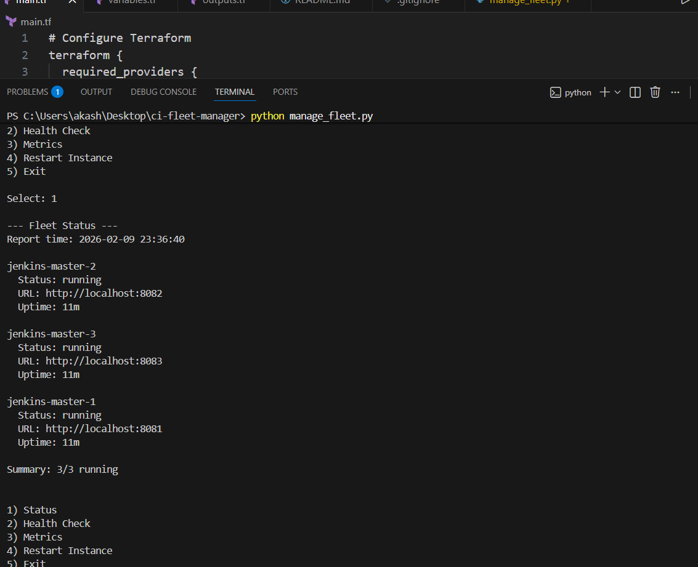
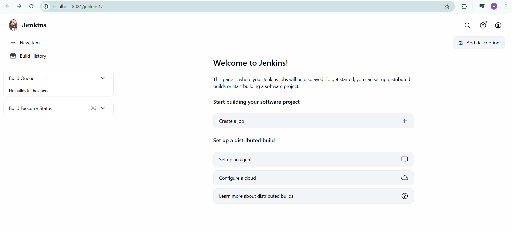
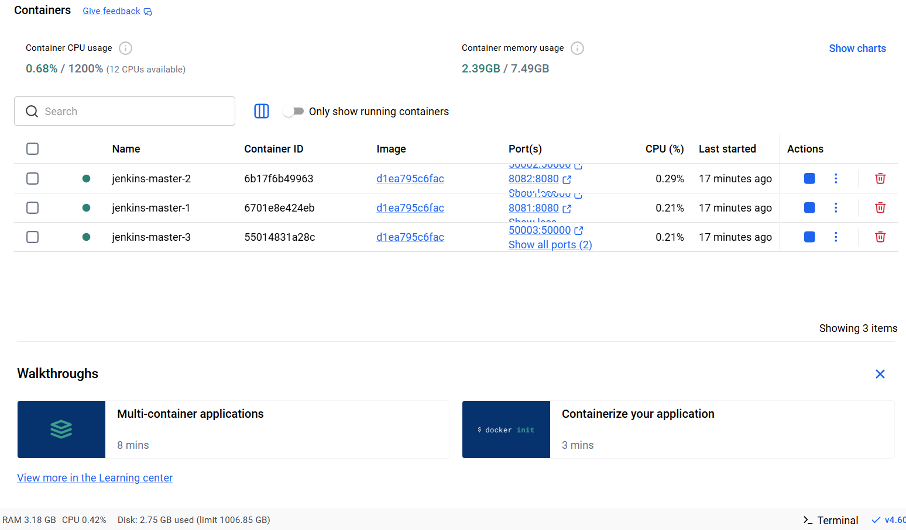

# CI Fleet Manager

Automated provisioning and management for Jenkins CI infrastructure.

This project spins up multiple Jenkins instances using Terraform and provides Python tooling to monitor and manage them. Built to demonstrate platform automation patterns for CI/CD infrastructure.

Fleet management tool showing all instances:


Jenkins instances accessible via browser:


Running containers in Docker:


**Setup**

Requirements:
- Docker Desktop
- Terraform
- Python with docker package (pip install docker)

Deploy:
```bash
terraform init
terraform apply
```

Monitor the fleet:
```bash
python manage_fleet.py
```

Jenkins instances run on ports 8081-8083.

Tear down:
```bash
terraform destroy
```

**What's included**

Infrastructure (Terraform):
- main.tf - Provisions 3 Jenkins containers on a shared Docker network
- variables.tf - Configuration options
- outputs.tf - Returns URLs and instance info

Automation (Python):
- manage_fleet.py - Fleet monitoring with health checks and metrics

**Why this approach**

Consistency - all instances provisioned from the same config  
Reproducibility - destroy and recreate identical environments  
Observability - real-time fleet status and metrics  
Scalability - change instance count in variables, reapply

**Scaling to production**

This uses Docker locally, but the same patterns apply to cloud. Swap Docker provider for AWS/Azure, replace containers with EC2/VMs, add load balancer, hook Python scripts to CloudWatch/Prometheus. The IaC structure and automation patterns stay the same.

**Notes**

Initial Jenkins setup requires the admin password from logs:
```bash
docker logs jenkins-master-1
```

Built for the Autodesk Platform Automation role application.